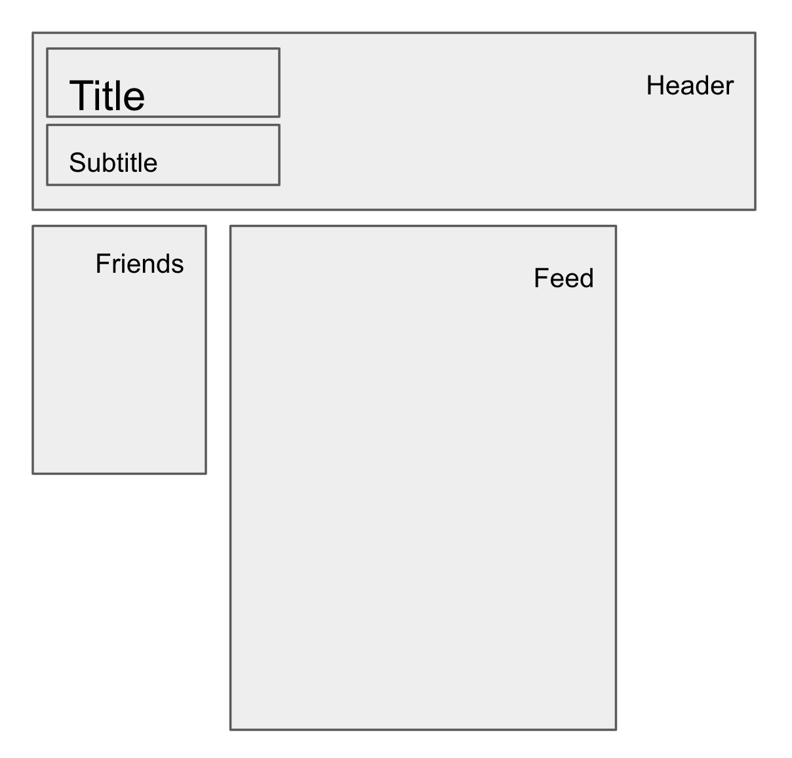
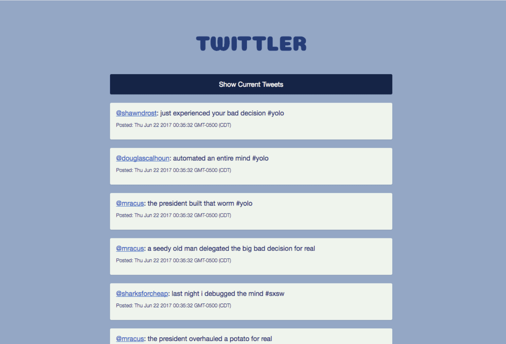
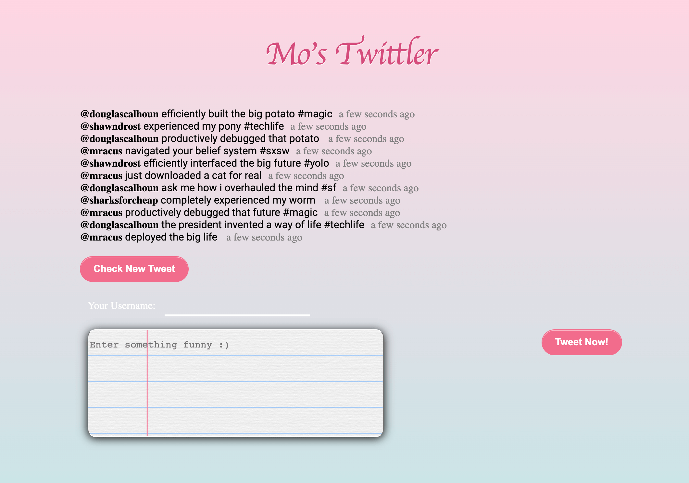
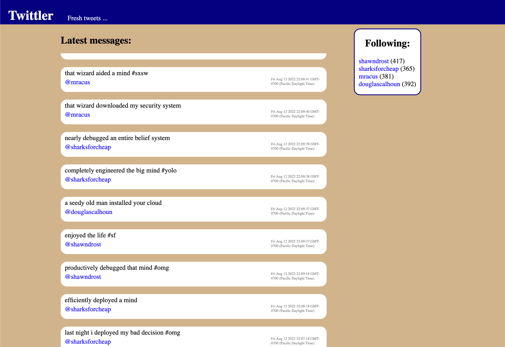
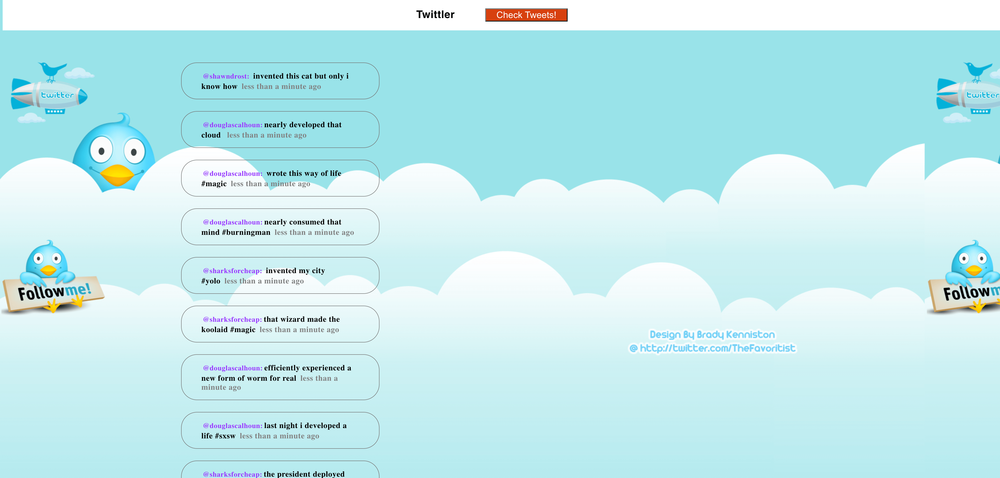
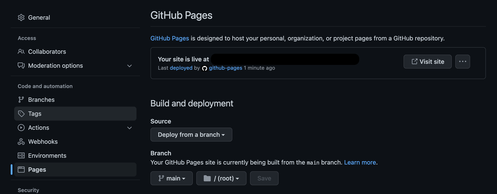

<!--
This is a markdown file. It can be viewed best as a preview with sublime: https://itsmetommy.com/2021/09/24/markdown-preview-using-sublime-text/ or in vs code with cmd + shift + v or on github. 
-->
# Introduction

Welcome to your first project! This project is intended to challenge you, and also to give you an opportunity to express some creativity and experiment. Don't worry too much about doing things the "right" way - this project is not graded. Do pay attention to how you try to work through these challenges - what is your default reaction? When in doubt, try a strategy for [getting unstuck](https://www.freecodecamp.org/news/how-to-get-unstuck/), then ask for help.

# Project Summary

You are going to build a social media website. Sportsball is a hot new app that lets fans share their favorite sports moments. Your job is to help develop the feed for website app (sportsball.com). You will use jquery in this project, which may be new to you - but don't worry, it is very similar to some of the native DOM apis you have worked with before.

# Prerequisites

## Data Model

[Connecting the Data Model to the DOM](https://frontend.turing.edu/lessons/module-1/javascript-connecting-the-data-model-to-the-dom.html) up to `Try it #5`

## HTML & CSS

In this project you will be asked to implement a layout using HTML and CSS.

[Planning a Layout in HTML](https://frontend.turing.edu/lessons/module-1/html-planning-layout.html)

[Layout in CSS](https://frontend.turing.edu/lessons/module-1/css-layout.html)

[CSS Selectors](https://web.dev/learn/css/selectors/) and [the box model](https://web.dev/learn/css/box-model/) may be helpful to review

Please use an external style sheet for any css in this project
[How to Create an External Style Sheet](https://www.webucator.com/article/how-to-create-a-css-external-style-sheet/)

## JQuery

JQuery is a js library that allows js to manipulate the DOM. In it's developers own words, working with the DOM and native browser APIs can get messy, so JQuery provides a layer of abstraction that makes it easier to manage. JQuery isn't used much for new development any more, but it's still around in old code on a lot of websites. In this project you are encouraged to use JQuery for everything. JQuery is just a JS file that contains a lot of helpers, and adds them to the global JS namespace (you can look at it in the project files).  It's imported as a `<src>` like any other js code.

The basic concept of JQuery is that it select elements, and then can manipulate them. For efficiency, please read these pages only in exactly this order:

[Selecting Elements](https://learn.jquery.com/using-jquery-core/selecting-elements/)

[Working with Selections](https://learn.jquery.com/using-jquery-core/working-with-selections/)

[Manipulating Elements](https://learn.jquery.com/using-jquery-core/manipulating-elements/)

[The JQuery Object](https://learn.jquery.com/using-jquery-core/jquery-object/)

In modern web applications, there is a lot of data that can change as the user interacts with the site. One way of storing this data is by attaching it to DOM Elements directly in the `data` attribute.
A common strategy is to attach data to an element that will be relevant when there is an interaction with element, for example when it is clicked. In a DOM Event, all attributes from the element (including `data`) are included.

JQuery provides an interface to attach and read data:
[Data Methods](https://learn.jquery.com/using-jquery-core/data-methods/)

JQuery provides an interface for all other attributes:
[Attributes](https://learn.jquery.com/using-jquery-core/attributes/)

JQuery can also be used to attach event handlers to events:
[Events in JQuery](https://learn.jquery.com/events/event-basics/)

## Markdown tips

This is a `checkbox` in [markdown](https://docs.github.com/en/get-started/writing-on-github/getting-started-with-writing-and-formatting-on-github/basic-writing-and-formatting-syntax):

```markdown
- []
```

On Github, it appears checked if there is an x in it:

```markdown
- [x]
```

You can use this to track your progress in this document.

# Part 1. Downloading the code

- First, [fork the repo on github](https://docs.github.com/en/get-started/quickstart/fork-a-repo). This makes your own copy of the code.
- Then, [clone the repo onto your computer](https://docs.github.com/en/repositories/creating-and-managing-repositories/cloning-a-repository). You are ready to code!
- As you make changes, save your work frequently by
  - using `git add` to stage your files
  - using `git commit` to save a snapshot of your saved files
- We will not use branching in this project, feel free to commit to main. You can ignore this if you don't know what that means.
- If you need to go back to a previous version, please reach out for help. This is often a confusing step for git beginners.

# Part 2. Running the app

- Use the finder to navigate into the repo and find `index.html`
- double click on `index.html` and open the web page in chrome (may require right click if default browser is not chrome)
- when you make changes to the code, save and refresh the page with `cntrl + r` to update the site

# Part 3. Exploring the starter app

It's recommended to open the directory in your editor so that you can switch between files easily. You will see a bare bones website:

- `index.html`: the html for the site
- `jquery.js`: a lightweight implementation of the jquery library you can use for DOM manipulation
- `data_generator.js`: a javascript file that generates post content for the app at random intervals

## Analyze the code and data model

1. In `index.html` you can see a `<script>` tag that contains js using jquery to initialize the site. What does this code do?
2. The code uses the variable `streams` which is not declared in the script. Where is this declared in the code base? (hint: use your editor's global search function)
3. What is the shape of the data model in the `streams` variable? By "shape" developers usually mean what are the fields in an object and what data types do those fields have.

    For example variable user might be an `object` with a field `name`, with type `String`, and a field `age`, with type `Number`. We can use Typescript to describe this shape like this. It's not important to know typescript for this project.

    ```ts
    /**
     * This is a typescript type definition
     * Use your intuition to understand what this means
     */
    type User = {
      name: String,
      age: Number,
      friends: String[], // <= brackets mean that it's an array of Strings
    };
    ```

    Edit this REAME file to complete the shape of the `streams` object:

    ```ts
    type Post = {
      // fill out the names in this shape (hint: Date is a valid type)
      // hint, these are produced in function generateRandompost()
    };
    type Streams = {
      home: post[],
      users: {
        // fill out the keys and types in this object
      }
    }
    ```

    Now that you know what the data looks like, it should be easier to work with it.

# Part 4. Write Code

## Organize the code

First, create a file named `app.js` in the repo, and move the js from the `<script>` tag into that file. Import the new script file into the html and verify that the app still works in the browser. Remember to commit your changes frequently! This is some hygiene to keep the code organized, because we're going to add a lot more javascript. From this point on, try to keep only html in the html file, and write all javascript in seperate files (you can write all the javascript in `app.js`).

Then use functions to further organize the code. There are two good times to break code down into functions:

1) As a general rule of thumb, functions should follow the `single responsiblity principle`, which means that you should be able to describe what the function does in one sentence. So if a function adds a post to the page and removes a post, split that into two functions. Then call both from a function that "replaces a post".

2) When code needs to be reused in multiple places in the app, it's best practice to put the code in a function, and simply call the function in multiple places instead of rewriting all the code. This advice is known as `write DRY code`, which stands for Don't Repeat Yourself.

- [x] Take the code js in `app.js` that loads the feed on the page and move it into a function called `loadFeed()`. Then call that function where the code was before.

## Make the page update when new posts are posted

The stream object (data model) is being updated at random intervals with new posts. It's important to add these posts to the feed as they are created.

- [x] Create a new function called `refreshFeed()`, that uses [setTimeout()](https://developer.mozilla.org/en-US/docs/Web/API/setTimeout) to call `loadFeed()` every 1 second. In software engineering, checking for updates periodically is called `polling`. For an example of how to use `setTimeout()`, look at the function `scheduleNextPost()` in `data_generator.js`. It generates new posts after a random interval.

- [x] Call `refreshFeed()` after the page is loaded, so that as new posts are added to the data model, they are shown on the page. You can adjust the delay if you feel it is impacting the page experience.

## Add basic Styling with CSS

Next, let's add some basic styling to the app. Use HTML and CSS to create a layout that looks like this:



First you will need to [create an external stylesheet](https://www.webucator.com/article/how-to-create-a-css-external-style-sheet/)

Then you will need to add Classes or Ids to DOM nodes so that css selectors and jquery selectors can interact with them. Ids should be unique and exist only on one DOM node. Classes may exists on multiple DOM nodes.
Hint: You can use [HTML](https://www.washington.edu/accesscomputing/webd2/student/unit3/module5/lesson1.html) or [JQuery](https://theprogrammingexpert.com/jquery-add-id-to-div/) to add Class and ID attributes.

1. Create a Header that is the full width of the page

- [x] including a title Heading "Sportsball.com" that is left aligned
- [x] including a subtitle Heading "Sports with your friends" that is left aligned
- [x] make the background of the heading a different color from the page - you can change this color later

2. [x] Create a container for the feed, and center it. You will need to update app.js so that it adds posts within the new container.
3. [x] Add a section called friends above the feed and render the name of each user in it. (what html tags are best for this?) Where are the users' names in the data model?
4. [x] Make the feed scrollable - but keep the header and friends in view
5. [x] Move the friends to the side of the feed instead of above the feed
6. [x] Display the post text, time created and user name in the posts

## Interactive Features

1. [x] When I click on a user name, it should show me a feed of only posts from that user
2. [x] When viewing a user's feed, the user's name should be displayed above the feed: "Latest messages from Babe Ruth"
3. [x] When viewing a user's feed, a button should be visible to view the home feed (of all users posts)
4. [x] Clicking on the Title or Subtitle should show me the home feed
5. [x] User names in posts should also be clickable and show me the user's feeds
6. [x] In the Friends section, display the number of posts next to each user, (e.g. "Babe Ruth - 39 posts")
7. [x] Display relative times (e.g. "one minute ago") instead of the actual time, using the library [timeago](http://timeago.yarp.com/)
8. [] Display images on posts, in addition to text, using the [ element](https://developer.mozilla.org/en-US/docs/Web/HTML/Element/img) and [setting the width](https://html.com/attributes/img-width/)

## Customize the interface

Style the app how you please. Get creative! You may choose to make it look like twitter, or your own creative design. Previous students have made a Twitter clone and done many intersting things:







## Optional Features (Advanced)

These are advanced topics that may be covered in future projects. As such you may have to do research to complete some of these.

- Add a search input to the friends section that filters the names of the friends
- Add a "create a post" section that let's a user input a post and add it to the home feed
- Animate the feed so that posts slide down into view. ([This may help to get you started](https://frontend.turing.edu/lessons/module-1/css-transitions-transformations)).
- In addition to images, display youtube videos.
      1) Add youtube links to the posts. This will require updating the data model in `data_generator.js`
      2) Add a youtube player to the DOM for each post (hint - youtube provides an embeddable player)

# Part 5. Publishing your code to GitHub

When you are ready to share your code for help or feedback, use the `git push` command to publish your code to GitHub.  Then [open a pull request from your fork](https://docs.github.com/en/pull-requests/collaborating-with-pull-requests/proposing-changes-to-your-work-with-pull-requests/creating-a-pull-request-from-a-fork) to the main repo for review.

# Part 6. Making your repo public

When the project is complete, you will be provided with a script to copy the code to a new public repo.

After that, if you'd like to share your site with anyone on the web, turn on github pages for your repo.

1. go to github settings:

  

2. scroll down to the github pages section. Set the `source` to `deploy from a branch` and set the `branch` to `main` / `root`. Click Save.

  
